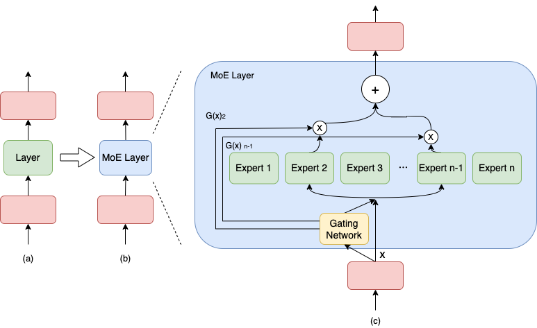

# MoeBert-BILSTM-CRF
使用MoeBert-BILSTM-CRF进行实体识别。



# 环境依赖

```sehll
torch==2.8.0
transformers==4.46.3
accelerate==1.10.0
numpy==1.26.4
jinja2==3.1.4
pydantic==2.8.2
```

# 运行

包含训练、验证和预测：`python main.py`

默认使用了以下优化方法：

- 加载预训练的权重并将FFN转换为Moe。
- 使用负载均衡loss缓解专家之间的不均衡。
- 使用Z-loss，鼓励logits的平方和变大，从而让门控网络做出更“自信”的决策。

虽然实际的测试结果下来好像并没有什么差异，当然可能和数据集以及超参数有关。

测试结果：

|             model             | epoch | eval_loss | micro_P | micro_R | micro_F1 |
| :---------------------------: | :---: | :-------: | :-----: | :-----: | :------: |
|     chinese-bert-wwm-ext      | 3.18  |   22.48   |  0.69   |  0.80   |   0.74   |
|  转换为Moe，Moe层随机初始化   | 50.00 |   46.11   |  0.60   |  0.71   |   0.65   |
| 转换为Moe，Moe层使用FFN的权重 | 3.64  |   22.21   |  0.69   |  0.77   |   0.73   |
|      再加上负载均衡Loss       | 3.64  |   16.64   |  0.70   |  0.76   |   0.73   |
|         再加上Z-Loss          | 3.64  |   15.61   |  0.69   |  0.77   |   0.73   |

```
文本>>>>>： 492号汽车故障报告故障现象一辆车用户用水清洗发动机后，在正常行驶时突然产生铛铛异响，自行熄火
实体>>>>>： {'故障原因': [('异响', 40, 41), ('熄火', 45, 46)]}
====================================================================================================
文本>>>>>： 故障现象：空调制冷效果差。
实体>>>>>： {'故障设备': [('空调', 5, 6)], '故障原因': [('制冷效果差', 7, 11)]}
====================================================================================================
文本>>>>>： 原因分析：1、遥控器失效或数据丢失;2、ISU模块功能失效或工作不良;3、系统信号有干扰导致。处理方法、体会：1、检查该车发现，两把遥控器都不能工作，两把遥控器同时出现故障的可能几乎是不存在的，由此可以排除遥控器本身的故障。2、检查ISU的功能，受其控制的部分全部工作正常，排除了ISU系统出现故障的可能。3、怀疑是遥控器数据丢失，用诊断仪对系统进行重新匹配，发现遥控器匹配不能正常进行。此时拔掉ISU模块上的电源插头，使系统强制恢复出厂设置，再插上插头，发现系统恢复，可以进行遥控操作。但当车辆发动在熄火后，遥控又再次失效。4、查看线路图发现，在点火开关处安装有一钥匙行程开关，当钥匙插入在点火开关内，处于ON位时，该开关接通，向ISU发送一个信号，此时遥控器不能进行控制工作。当钥匙处于OFF位时，开关断开，遥控器恢复工作，可以对门锁进行控制。如果此开关出现故障，也会导致遥控器不能正常工作。同时该行程开关也控制天窗的自动回位功能。测试天窗发现不能自动回位。确认该开关出现故障
实体>>>>>： {'故障设备': [('遥控器', 7, 9), ('ISU模块', 20, 24), ('系统信号', 37, 40), ('遥控器', 66, 68), ('遥控器', 158, 160), ('遥控器', 182, 184), ('开关', 434, 435)], '故障原因': [('失效', 10, 11), ('数据', 13, 14), ('丢失', 15, 16), ('功能失效', 25, 28), ('工作不良', 30, 33), ('干扰', 42, 43), ('不能工作', 70, 73), ('数据丢失', 161, 164), ('失效', 260, 261), ('不能自动回位', 424, 429), ('故障', 438, 439)]}
====================================================================================================
文本>>>>>： 原因分析：1、发动机点火系统不良;2、发动机系统油压不足;3、喷嘴故障;4、发动机缸压不足;5、水温传感器故障。
实体>>>>>： {'故障设备': [('发动机点火系统', 7, 13), ('发动机系统', 19, 23), ('喷嘴', 31, 32), ('发动机', 38, 40), ('水温传感器', 48, 52)], '故障原因': [('不良', 14, 15), ('油压不足', 24, 27), ('故障', 33, 34), ('缸压不足', 41, 44), ('故障', 53, 54)]}
====================================================================================================
```

# 说明

## 如何将一个transformer模型转换为Moe模型？

这里简单的将FFN进行重复，构建了4个专家，每次选择topk=2的专家。具体代码：

```python
class BertIntermediate(nn.Module):
    def __init__(self, config):
        super().__init__()
        self.dense = nn.Linear(config.hidden_size, config.intermediate_size)
        if isinstance(config.hidden_act, str):
            self.intermediate_act_fn = ACT2FN[config.hidden_act]
        else:
            self.intermediate_act_fn = config.hidden_act

    def forward(self, hidden_states: torch.Tensor) -> torch.Tensor:
        hidden_states = self.dense(hidden_states)
        hidden_states = self.intermediate_act_fn(hidden_states)
        return hidden_states


class BertOutput(nn.Module):
    def __init__(self, config):
        super().__init__()
        self.dense = nn.Linear(config.intermediate_size, config.hidden_size)
        self.LayerNorm = nn.LayerNorm(config.hidden_size, eps=config.layer_norm_eps)
        self.dropout = nn.Dropout(config.hidden_dropout_prob)

    def forward(self, hidden_states: torch.Tensor, input_tensor: torch.Tensor) -> torch.Tensor:
        hidden_states = self.dense(hidden_states)
        hidden_states = self.dropout(hidden_states)
        hidden_states = self.LayerNorm(hidden_states + input_tensor)
        return hidden_states


# ---------------- START OF MOE MODIFICATIONS ----------------

class BertExpert(nn.Module):
    """
    An expert module consisting of a BertIntermediate and BertOutput layer.
    This is the same as the original FFN block in a standard BERT layer.
    """

    def __init__(self, config):
        super().__init__()
        self.intermediate = BertIntermediate(config)
        self.output = BertOutput(config)

    def forward(self, hidden_states):
        # The input hidden_states is the output of the attention block.
        # It is passed to the intermediate layer and used for the residual connection in the output layer.
        intermediate_output = self.intermediate(hidden_states)
        layer_output = self.output(intermediate_output, hidden_states)
        return layer_output


class BertMoELayer(nn.Module):
    """
    A Mixture-of-Experts (MoE) layer that replaces the FFN block in a BertLayer.
    It uses a top-k gating mechanism to route tokens to a subset of experts.
    """

    def __init__(self, config):
        super().__init__()
        self.num_experts = config.num_experts  # Total number of experts
        self.top_k = config.top_k  # Number of experts to activate per token

        # Gating network
        self.gate = nn.Linear(config.hidden_size, self.num_experts)

        # Expert networks
        self.experts = nn.ModuleList([BertExpert(config) for _ in range(self.num_experts)])

        # 新增：负载均衡损失的超参数
        self.load_balancing_alpha = 0.01

    def forward(self, hidden_states: torch.Tensor) -> torch.Tensor:
        """
        Args:
            hidden_states (torch.Tensor): The input tensor from the attention layer.
                                          Shape: (batch_size, seq_len, hidden_size)
        Returns:
            torch.Tensor: The output of the MoE layer.
                          Shape: (batch_size, seq_len, hidden_size)
        """
        batch_size, seq_len, hidden_size = hidden_states.shape
        # Reshape for token-level routing
        hidden_states_reshaped = hidden_states.view(-1, hidden_size)

        # Get routing weights from the gate
        router_logits = self.gate(hidden_states_reshaped)
        routing_weights = nn.functional.softmax(router_logits, dim=1)

        # Find top-k experts for each token
        top_k_weights, top_k_indices = torch.topk(routing_weights, self.top_k, dim=-1)

        # Normalize the top-k weights so they sum to 1
        top_k_weights = top_k_weights / torch.sum(top_k_weights, dim=-1, keepdim=True)

        # Initialize the final output tensor
        final_hidden_states = torch.zeros_like(hidden_states_reshaped)

        # Route each token to its selected experts
        for i in range(self.num_experts):
            # Find tokens that have selected this expert in their top-k
            idx, pos = torch.where(top_k_indices == i)

            if idx.numel() == 0:
                continue

            # Select the input hidden states for these tokens
            expert_input = hidden_states_reshaped[idx]

            # Pass through the expert
            expert_output = self.experts[i](expert_input)

            # Get the corresponding weights
            weights = top_k_weights[idx, pos]

            # Weight the expert output and add it to the final tensor
            weighted_output = expert_output * weights.unsqueeze(-1)
            final_hidden_states.index_add_(0, idx, weighted_output)

        return final_hidden_states.view(batch_size, seq_len, hidden_size)

# ---------------- END OF MOE MODIFICATIONS ----------------
```

## 在训练初期，门控网络可能倾向于将大部分token都发送给少数几个“受欢迎”的专家怎么办？

这会导致：

- 专家饥饿 (Expert Starvation)：一些专家很少或根本没有收到token进行训练，它们的参数得不到更新，变成了“无用”的专家。
- 资源浪费：模型的总参数量很大，但实际使用的只是一小部分。
- 训练不稳定：梯度集中在少数专家上。

解决方案：引入一个辅助损失函数 (auxiliary loss)，即负载均衡损失，来惩罚不均衡的路由行为。这个损失会鼓励门控网络将token大致均匀地分配给所有专家。

最常见的负载均衡损失公式（来自Switch Transformer论文）如下：

$loss_aux = α * N * Σ (f_i * P_i)$
其中：

- N 是专家的数量（这里是4）。
- $f_i $是分配给专家 i 的token比例。例如，如果有100个token，专家 i 被分配了30个，那么 $f_i$ = 0.3。
- $P_i $是门控网络为专家 i 输出的平均路由概率。
- $α (alpha)$ 是一个超参数，用于控制这个辅助损失的重要性，通常设置为一个小值（例如 0.01）。

代码如下：

```python
class BertMoELayer(nn.Module):
    """
    A Mixture-of-Experts (MoE) layer that replaces the FFN block in a BertLayer.
    It uses a top-k gating mechanism to route tokens to a subset of experts.
    """

    def __init__(self, config):
        super().__init__()
        self.num_experts = config.num_experts  # Total number of experts
        self.top_k = config.top_k  # Number of experts to activate per token

        # Gating network
        self.gate = nn.Linear(config.hidden_size, self.num_experts)

        # Expert networks
        self.experts = nn.ModuleList([BertExpert(config) for _ in range(self.num_experts)])

        # 新增：负载均衡损失的超参数
        self.load_balancing_alpha = 0.01

    def forward(self, hidden_states: torch.Tensor) -> torch.Tensor:
        """
        Args:
            hidden_states (torch.Tensor): The input tensor from the attention layer.
                                          Shape: (batch_size, seq_len, hidden_size)
        Returns:
            torch.Tensor: The output of the MoE layer.
                          Shape: (batch_size, seq_len, hidden_size)
        """
        batch_size, seq_len, hidden_size = hidden_states.shape
        # Reshape for token-level routing
        hidden_states_reshaped = hidden_states.view(-1, hidden_size)

        # Get routing weights from the gate
        router_logits = self.gate(hidden_states_reshaped)
        routing_weights = nn.functional.softmax(router_logits, dim=1)

        # --- 计算负载均衡损失 ---
        # f_i: 每个专家处理的token比例
        # P_i: 每个专家的平均路由概率
        num_tokens = hidden_states_reshaped.shape[0]

        # one-hot编码，标记每个token被分配给了哪些专家
        expert_mask = nn.functional.one_hot(torch.topk(routing_weights, self.top_k, dim=-1).indices,
                                            self.num_experts).sum(dim=1)
        tokens_per_expert = expert_mask.sum(dim=0)

        f_i = tokens_per_expert / num_tokens
        P_i = routing_weights.mean(dim=0)

        # 计算损失
        load_balancing_loss = self.num_experts * torch.sum(f_i * P_i) * self.load_balancing_alpha
        # --- 损失计算结束 ---

        # Find top-k experts for each token
        top_k_weights, top_k_indices = torch.topk(routing_weights, self.top_k, dim=-1)

        # Normalize the top-k weights so they sum to 1
        top_k_weights = top_k_weights / torch.sum(top_k_weights, dim=-1, keepdim=True)

        # Initialize the final output tensor
        final_hidden_states = torch.zeros_like(hidden_states_reshaped)

        # Route each token to its selected experts
        for i in range(self.num_experts):
            # Find tokens that have selected this expert in their top-k
            idx, pos = torch.where(top_k_indices == i)

            if idx.numel() == 0:
                continue

            # Select the input hidden states for these tokens
            expert_input = hidden_states_reshaped[idx]

            # Pass through the expert
            expert_output = self.experts[i](expert_input)

            # Get the corresponding weights
            weights = top_k_weights[idx, pos]

            # Weight the expert output and add it to the final tensor
            weighted_output = expert_output * weights.unsqueeze(-1)
            final_hidden_states.index_add_(0, idx, weighted_output)

        # Reshape back to the original shape
        return final_hidden_states.view(batch_size, seq_len, hidden_size), load_balancing_loss
```

## 门控网络的logits（gate层的直接输出）的数值大小会影响训练稳定性？

如果logits的绝对值太小，softmax后的概率分布会趋于平坦，使得路由决策不明确，梯度信号变弱。

解决方案：添加一个Z-loss，鼓励logits的平方和变大，从而让门控网络做出更“自信”的决策。

$loss_z = β * (log(Σ exp(l_i)))^2$

其中 $l_i $是token的logits，$β (beta)$ 是一个小的超参数（例如 1e-4）。

代码如下：

```python
class BertMoELayer(nn.Module):
    """
    A Mixture-of-Experts (MoE) layer that replaces the FFN block in a BertLayer.
    It uses a top-k gating mechanism to route tokens to a subset of experts.
    """

    def __init__(self, config):
        super().__init__()
        self.num_experts = config.num_experts  # Total number of experts
        self.top_k = config.top_k  # Number of experts to activate per token

        # Gating network
        self.gate = nn.Linear(config.hidden_size, self.num_experts)

        # Expert networks
        self.experts = nn.ModuleList([BertExpert(config) for _ in range(self.num_experts)])

        # 新增：负载均衡损失的超参数
        self.load_balancing_alpha = 0.01

    def forward(self, hidden_states: torch.Tensor) -> torch.Tensor:
        """
        Args:
            hidden_states (torch.Tensor): The input tensor from the attention layer.
                                          Shape: (batch_size, seq_len, hidden_size)
        Returns:
            torch.Tensor: The output of the MoE layer.
                          Shape: (batch_size, seq_len, hidden_size)
        """
        batch_size, seq_len, hidden_size = hidden_states.shape
        # Reshape for token-level routing
        hidden_states_reshaped = hidden_states.view(-1, hidden_size)

        # Get routing weights from the gate
        router_logits = self.gate(hidden_states_reshaped)
        routing_weights = nn.functional.softmax(router_logits, dim=1)

        # --- 计算负载均衡损失 ---
        # f_i: 每个专家处理的token比例
        # P_i: 每个专家的平均路由概率
        num_tokens = hidden_states_reshaped.shape[0]

        # one-hot编码，标记每个token被分配给了哪些专家
        expert_mask = nn.functional.one_hot(torch.topk(routing_weights, self.top_k, dim=-1).indices,
                                            self.num_experts).sum(dim=1)
        tokens_per_expert = expert_mask.sum(dim=0)

        f_i = tokens_per_expert / num_tokens
        P_i = routing_weights.mean(dim=0)

        # 计算损失
        load_balancing_loss = self.num_experts * torch.sum(f_i * P_i) * self.load_balancing_alpha
        # --- 损失计算结束 ---

        # --- 计算 Router Z-Loss ---
        log_sum_exp = torch.logsumexp(router_logits, dim=1)
        z_loss = torch.mean(log_sum_exp ** 2) * 1e-4
        # --- 损失计算结束 - --

        # Find top-k experts for each token
        top_k_weights, top_k_indices = torch.topk(routing_weights, self.top_k, dim=-1)

        # Normalize the top-k weights so they sum to 1
        top_k_weights = top_k_weights / torch.sum(top_k_weights, dim=-1, keepdim=True)

        # Initialize the final output tensor
        final_hidden_states = torch.zeros_like(hidden_states_reshaped)

        # Route each token to its selected experts
        for i in range(self.num_experts):
            # Find tokens that have selected this expert in their top-k
            idx, pos = torch.where(top_k_indices == i)

            if idx.numel() == 0:
                continue

            # Select the input hidden states for these tokens
            expert_input = hidden_states_reshaped[idx]

            # Pass through the expert
            expert_output = self.experts[i](expert_input)

            # Get the corresponding weights
            weights = top_k_weights[idx, pos]

            # Weight the expert output and add it to the final tensor
            weighted_output = expert_output * weights.unsqueeze(-1)
            final_hidden_states.index_add_(0, idx, weighted_output)

        # Reshape back to the original shape
        # 将这个z_loss加到load_balancing_loss上一起返回
        total_aux_loss = load_balancing_loss + z_loss
        return final_hidden_states.view(batch_size, seq_len, hidden_size), total_aux_loss
```

# 进一步优化

以下可能是进一步可以改进的地方但是还没有尝试。

## 在硬件（尤其是GPU/TPU）上，动态地为每个专家分配不同数量的token（index_add_操作）效率不高

解决方案：为每个专家设置一个固定的“容量”（Capacity），即它每批次最多能处理的token数量。

Capacity = (总token数 / 专家数) * Capacity Factor

Capacity Factor 通常设置为1.25到2.0之间。

工作流程：

- 计算每个专家的容量。
- 对于每个专家，找出被分配给它的token。
- 如果被分配的token数量超过了容量，就丢弃 (drop) 超出部分的token。这些被丢弃的token将直接通过残差连接（即不经过任何专家处理）传递到下一层。这使得计算可以被静态地塑形和编译，在硬件上运行得更快。

权衡：

- 优点：训练速度大幅提升。
- 缺点：可能会丢失信息（因为token被丢弃了）。但实践证明，只要Capacity Factor设置得当，对模型性能影响很小。

## 差分学习率 (Differential Learning Rates)：为模型的不同部分设置不同的学习率。

可以为新添加的MoE层（尤其是门控网络）设置一个比预训练部分（如注意力层）更高的学习率，让它们更快地适应新任务。

## 专家冻结与微调

在微调的早期阶段，可以尝试冻结所有专家，只训练门控网络。让门控网络先学会如何路由。然后再解冻所有层，进行端到端的微调。

## 从多个预训练模型中融合专家 (Ensemble of Pre-trained Models)

思路：与其从一个预训练模型中克隆权重，不如从多个不同但相关的预训练模型中提取FFN层作为专家。

示例：假设您要做一个通用的问答模型。您可以：

- 专家1：来自 bert-base-uncased 的FFN层。
- 专家2：来自 roberta-base 的FFN层（需要注意结构对齐）。
- 专家3：来自一个在SQuAD数据集上微调过的BERT模型的FFN层。
- 专家4：来自一个在法律或医学领域语料上继续预训练过的BERT模型的FFN层。

为什么有效？

- 天生的多样性：每个专家从一开始就携带了来自不同训练数据、不同架构或不同任务的“知识基因”。这为门控网络提供了丰富的、有意义的选择空间。
- 知识融合：模型可以学会根据输入的上下文，动态地选择最相关的知识源。例如，当遇到一个法律问题时，门控网络可能会更多地激活来自法律领域模型的专家。
- 强大的起点：所有专家都已经是“训练有素”的，而不是从随机或单一克隆开始，这比单一模型克隆的起点更强。
  挑战：
- 模型获取：需要找到或训练多个合适的预训练模型。
- 结构对齐：不同模型（如BERT和RoBERTa）的FFN层结构可能略有不同，需要确保它们的输入输出维度一致。对于同为BERT架构的模型，这通常不是问题。

## 结构异构的专家 (Structurally Heterogeneous Experts)

思路：让专家们在结构上有所不同，而不仅仅是权重不同。

示例：

- 专家1 (标准)：标准的 BertIntermediate + BertOutput 结构。intermediate_size 是 hidden_size 的4倍。
- 专家2 (更宽)：一个intermediate_size更宽的FFN，例如是hidden_size的6倍。这个专家计算量更大，但可能能捕捉更复杂的模式。
- 专家3 (更窄)：一个intermediate_size更窄的FFN，例如是hidden_size的2倍。这个专家计算量小，速度快，适合处理简单的token。
- 专家4 (更深)：一个由两个较小的FFN层堆叠而成的专家。

为什么有效？

- 计算预算的动态分配：门控网络可以学会将“简单”的token（如停用词"the", "a"）路由到计算成本低的窄专家，而将“复杂”或重要的token路由到计算成本高但能力强的宽专家或深专家。
- 功能特化：不同结构的专家天然地适合处理不同复杂度的特征。

挑战：

- 实现复杂：需要为不同专家定义不同的类或配置。
- 超参调整：需要仔细设计和调整每个专家的结构，这是一个新的超参数空间。

## 基于不同激活函数的专家 (Activation Function Diversity)

思路：保持所有专家的网络结构（Linear层）相同，但为它们使用不同的非线性激活函数。

示例：

- 专家1：使用 GELU (BERT默认)。
- 专家2：使用 ReLU。
- 专家3：使用 Swish (或 SiLU)。
- 专家4：使用 Mish。

为什么有效？

- 引入归纳偏置：不同的激活函数有不同的数学特性（如平滑度、有界性、稀疏性），这会引导专家学习不同类型的函数映射。
- 简单且有效：这是最容易实现的多样化策略之一，只需在每个BertExpert的intermediate层中更改激活函数即可。
- 避免饱和：某些激活函数（如ReLU）在负区会饱和，而其他函数（如GELU/Mish）则不会，这种差异可能对学习有益。

## 混合参数共享模式 (Hybrid Parameter Sharing)

思路：让一部分专家共享参数，另一部分不共享。这是一种在完全共享（即标准FFN）和完全独立（即标准MoE）之间的折中。

示例：假设我们有8个专家。

- 可以创建4个基础的BertExpert模块。
- 专家1, 2：共享第一个基础模块的intermediate层，但有各自独立的output层。
- 专家3, 4：共享第二个基础模块的所有参数（即它们是同一个专家，但门控网络可以给它们分配不同的概率）。
- 专家5, 6, 7, 8：各自使用独立的、不共享的基础模块。

为什么有效？

- 权衡参数量和性能：在不显著增加总参数量的情况下，增加了有效专家的数量。
- 层次化学习：共享的intermediate层可以学习通用特征，而独立的output层可以在这些通用特征之上进行微调和特化。
  挑战：
- 实现起来非常复杂，需要精细的参数管理。
